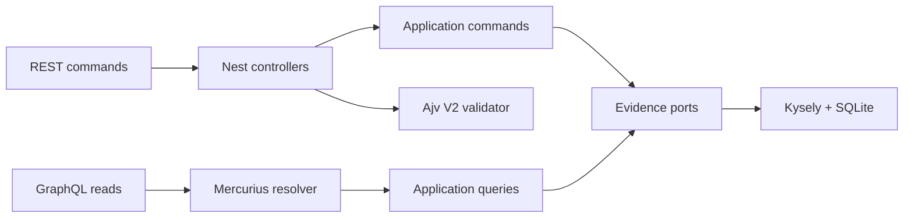

# #31 portfolio-evidence-api

**Proves:** reproducible benchmark evidence can be validated, stored, compared, and governed behind stable REST and GraphQL contracts.

**Benchmark:** `ingestion_p95_ms = pending ms` for the publishable Node 24 Docker baseline.

**Status:** implemented; final clean-source benchmark pending.

## Run

```bash
docker build -t portfolio-evidence-api .
docker run --rm -p 3000:3000 -v evidence-data:/app/data portfolio-evidence-api
```

No API key, cloud account, broker, or paid service is required. The image runs as UID 1000 and persists SQLite data in `/app/data`.

## API

| Boundary   | Endpoint                                      | Responsibility                                                 |
| ---------- | --------------------------------------------- | -------------------------------------------------------------- |
| REST       | `POST /v1/evidence/benchmark-runs`            | Validate and atomically ingest V2 evidence                     |
| REST       | `POST /v1/operations/benchmark-runs/:runId/*` | Idempotent revalidation, quarantine, and publication decisions |
| GraphQL    | `POST /graphql`                               | Read, filter, paginate, and compare benchmark runs             |
| Operations | `GET /health`, `GET /metrics`                 | SQLite readiness and Prometheus telemetry                      |

REST owns state-changing commands because HTTP status and `Idempotency-Key` semantics are explicit. GraphQL is read-only and serves the two portfolio consoles without introducing mutation ambiguity.

## Benchmark

Fast calibration, which never writes publishable evidence:

```bash
docker run --rm portfolio-evidence-api benchmark --calibrate
```

The full workload uses 25 warmups, 500 measured requests, concurrency 8, and 3 repeats for both ingestion and GraphQL. It also proves invalid evidence returns 400 and duplicate run IDs return 409. A publishable run requires a clean source SHA and the real image digest.

| Metric               |                   Value | Direction        |
| -------------------- | ----------------------: | ---------------- |
| Ingestion p95        |              pending ms | lower is better  |
| Ingestion throughput | pending requests/second | higher is better |
| GraphQL query p95    |              pending ms | lower is better  |

The result is validated against `contracts/benchmark-result-v2.schema.json` and stored at `benchmarks/results/latest.json`.

## Architecture



The dependency direction is inward. Domain and use cases import no Nest, Fastify, GraphQL, Kysely, SQLite, broker, or cloud SDK. LSP is exercised by replacing ports with test doubles; SRP, ISP, and DIP keep command, query, validation, and persistence reasons to change separate. KISS is visible in what is absent: no CQRS framework, message broker, cloud adapter, or microservice split without a problem that needs one.

## Verification

- 31 tests across use cases, schema validation, SQLite, HTTP, GraphQL, and benchmark statistics.
- 93.05% statements/lines, 89.4% branches, and 100% functions on the tested core/adapters.
- Node 24 multi-stage Docker image, non-root runtime, healthcheck, and reproducible lockfile.
- Prometheus metrics and Pino redaction for authorization and cookie headers.

## Decisions

SQLite is the correct local-first baseline for one evidence writer. PostgreSQL becomes justified only when concurrent writers or remote durability appear. Kumo is not started because this project has no cloud behavior; if artifact storage enters scope, a storage port must prove Kumo first and keep AWS behind a replaceable adapter.

See `sdd/`, `openspec/artifacts/`, and `REFERENCES.md` for the complete decision record and reuse trail.
