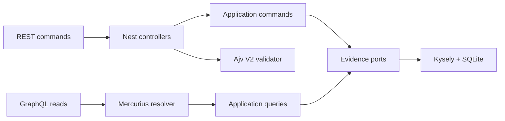

# Portfolio Evidence API: Benchmark Results as Validated, Governed Data

**`ingestion_p95_ms = 40.201 ms`** for the clean-source Node 24 Docker baseline, with `438.148` requests/second and `24.119 ms` GraphQL p95. The service accepts benchmark evidence only when it can be reproduced, stores it atomically, and serves comparisons through a read-only GraphQL API.

[](https://github.com/Brilhante29/portfolio-evidence-api/actions/workflows/ci.yml)
[](LICENSE)
  

## Why this exists

Most benchmarks end as a number pasted into a README, with no way to tell which commit, image, or workload produced it, or whether two numbers are even comparable. Every repository in this portfolio publishes evidence in the `benchmark-result-v2` format instead; this service treats that evidence as data with a contract:

- ingestion validates workload, environment, source commit, image digest, dependency lock, and comparability key, and rejects anything incomplete with `400`;
- duplicate run IDs return `409`, and state changes (revalidate, quarantine, publish) are idempotent REST commands with `Idempotency-Key`;
- reads go through GraphQL, so consoles can filter, paginate, and compare runs without owning any write policy;
- the benchmark itself proves the invalid-evidence and duplicate paths, not just the happy path.

## Results

Fast calibration (never writes publishable evidence): `docker run --rm portfolio-evidence-api benchmark --calibrate`.

The full workload uses 25 warm-ups, 500 measured requests, concurrency 8, and 3 repeats for both ingestion and GraphQL. A publishable run requires a clean source SHA and the real image digest.

| Metric               |                   Value | Direction        |
| -------------------- | ----------------------: | ---------------- |
| Ingestion p95        |               40.201 ms | lower is better  |
| Ingestion throughput | 438.148 requests/second | higher is better |
| GraphQL query p95    |               24.119 ms | lower is better  |

The result is validated against [`contracts/benchmark-result-v2.schema.json`](contracts/benchmark-result-v2.schema.json) and stored in [`benchmarks/results/latest.json`](benchmarks/results/latest.json). It was measured on Docker Desktop (WSL2, 6 vCPUs); compare only artifacts with the same `comparability_key`. The implementation passed [GitHub CI run 33204777497](https://github.com/Brilhante29/portfolio-evidence-api/actions/runs/33204777497).

## Quickstart

```bash
docker build -t portfolio-evidence-api .
docker run --rm -p 3000:3000 -v evidence-data:/app/data portfolio-evidence-api
```

No API key, cloud account, broker, or paid service is required. The image runs as UID 1000 and persists SQLite data in `/app/data`.

| Boundary   | Endpoint                                      | Responsibility                                                 |
| ---------- | --------------------------------------------- | -------------------------------------------------------------- |
| REST       | `POST /v1/evidence/benchmark-runs`            | Validate and atomically ingest V2 evidence                     |
| REST       | `POST /v1/operations/benchmark-runs/:runId/*` | Idempotent revalidation, quarantine, and publication decisions |
| GraphQL    | `POST /graphql`                               | Read, filter, paginate, and compare benchmark runs             |
| Operations | `GET /health`, `GET /metrics`                 | SQLite readiness and Prometheus telemetry                      |

REST owns state-changing commands because HTTP status codes and idempotency semantics are explicit there; GraphQL stays read-only to avoid mutation ambiguity.

## How it works


```mermaid
flowchart LR
  REST["REST commands"] --> HTTP["Nest controllers"]
  GQL["GraphQL reads"] --> Resolver["Mercurius resolver"]
  HTTP --> Commands["Application commands"]
  Resolver --> Queries["Application queries"]
  Commands --> Ports["Evidence ports"]
  Queries --> Ports
  Ports --> SQLite["Kysely + SQLite"]
  HTTP --> Ajv["Ajv V2 validator"]
```

The dependency direction is inward: domain and use cases import no Nest, Fastify, GraphQL, Kysely, SQLite, broker, or cloud SDK, and tests replace the ports with doubles.

## Design decisions

| Decision                                    | Why                                                           | Rejected for now                                                |
| ------------------------------------------- | ------------------------------------------------------------- | --------------------------------------------------------------- |
| Commands on REST, reads on GraphQL          | Explicit idempotency for writes, flexible selection for reads | GraphQL mutations; REST-only reads for comparison views         |
| NestJS on Fastify, Mercurius                | Modular structure with a fast HTTP layer                      | Express default adapter                                         |
| SQLite through Kysely                       | Correct for one evidence writer, typed SQL, zero operations   | PostgreSQL before concurrent writers or remote durability exist |
| Ajv against the shared V2 schema            | The same contract every repository produces                   | Hand-written validation                                         |
| No broker, CQRS framework, or cloud adapter | Nothing in the problem needs them                             | Architecture for its own sake                                   |

## Testing

```bash
npm ci
npm run check   # format, lint, typecheck, tests, build
```

- 35 tests across use cases, schema validation, SQLite, HTTP, GraphQL, benchmark statistics, and the dependency-audit transport.
- 93.05% statements and lines, 89.4% branches, 100% functions on the tested core and adapters.
- Prometheus metrics and Pino redaction for authorization and cookie headers.
- CI validates checks, coverage, calibration, dependency advisories, repository policy, Docker runtime health, and Docker calibration.

## Limitations

- Single writer by design; concurrent ingestion at scale needs a different store.
- No authentication on the API yet; deploy behind a gateway for anything beyond local use.
- Local Docker numbers; not a hosted-capacity claim.

## Project structure

```text
src/modules/       evidence domain, application commands and queries, HTTP, GraphQL, SQLite adapters
test/              use case, validator, repository, API, statistics, and audit tests
contracts/         benchmark-result-v2 schema and producer contracts
design-system/     shared tokens for the portfolio consoles
benchmarks/  tools/  results, benchmark runner, validators
sdd/  openspec/    decisions and reuse trail
```

## How this repository is built

The project follows the spec-driven workflow of [portfolio-reuse-kit](https://github.com/Brilhante29/portfolio-reuse-kit). Requirements and decisions live in [`sdd/`](sdd) and [`openspec/artifacts/`](openspec/artifacts/), and [`project.yaml`](project.yaml) records the architecture, stack, and rejected alternatives. Development is AI-assisted and human-governed: [`AGENTS.md`](AGENTS.md) and [`CLAUDE.md`](CLAUDE.md) hold the coding-agent instructions, while tests, validators, and CI decide what gets published.

## Related work

- [portfolio-evidence-console](https://github.com/Brilhante29/portfolio-evidence-console): the Next.js console that reads this API.
- [portfolio-reuse-kit](https://github.com/Brilhante29/portfolio-reuse-kit): defines the V2 evidence contract every project emits.

See [`REFERENCES.md`](REFERENCES.md) for the reuse trail.

## Author

**Guilherme Brilhante**, software engineer working on scalable backends and production AI.
[LinkedIn](https://www.linkedin.com/in/guilhermefreirebrilhanteseveriano/) · [GitHub](https://github.com/Brilhante29) · [Publications](https://dblp.org/pid/353/6812.html)

## License

[MIT](LICENSE).
